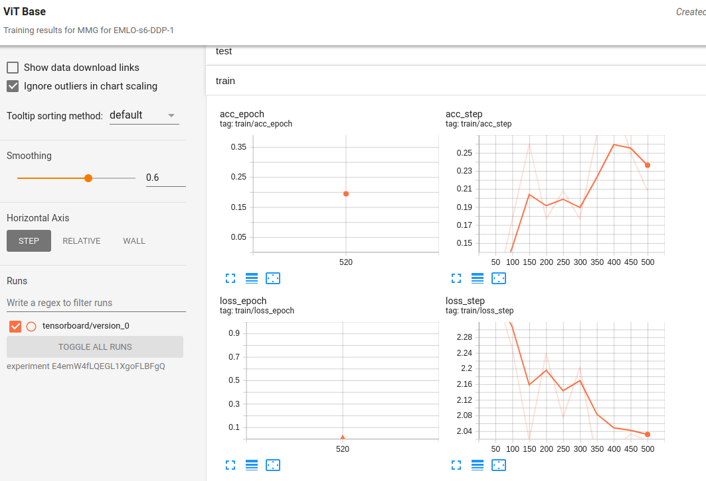
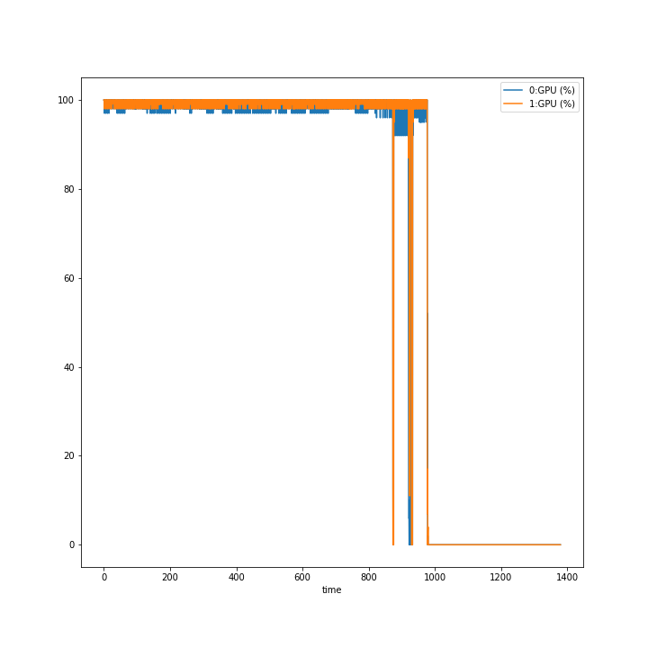
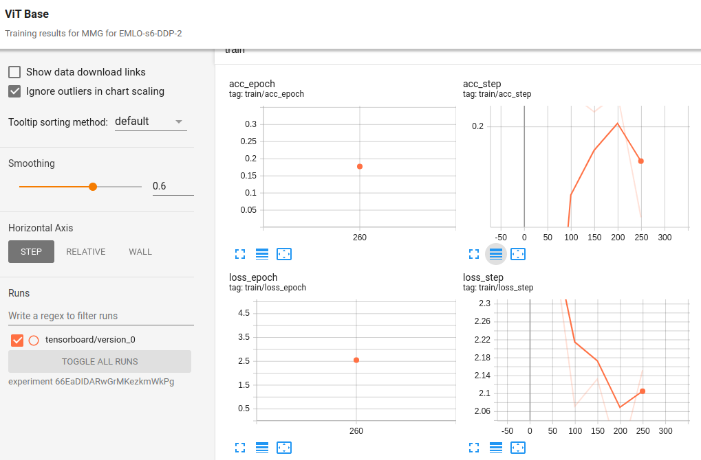
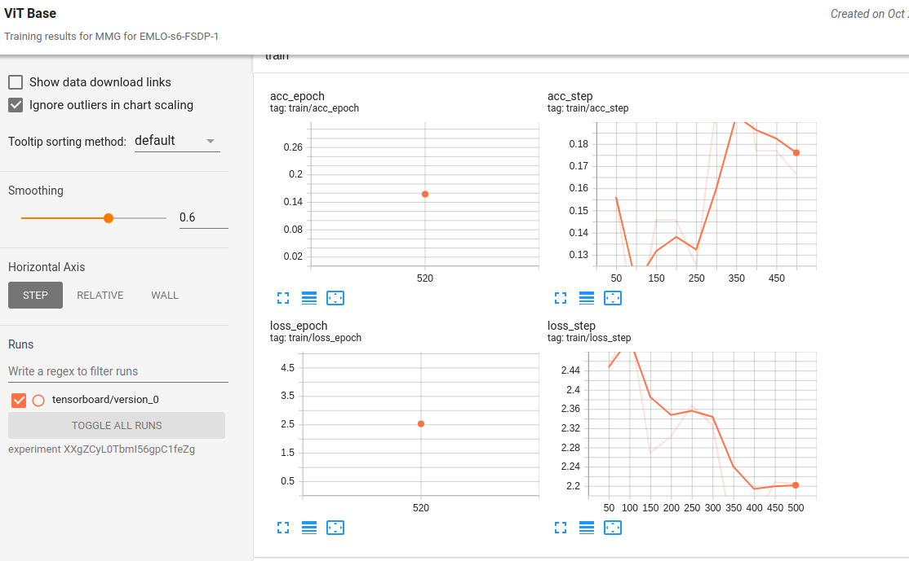
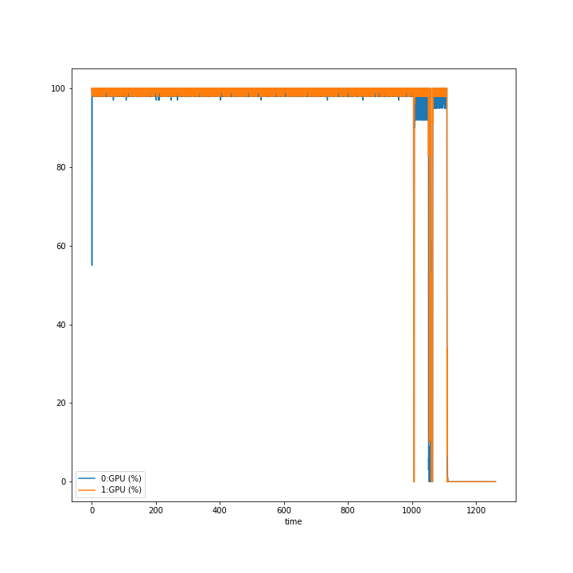
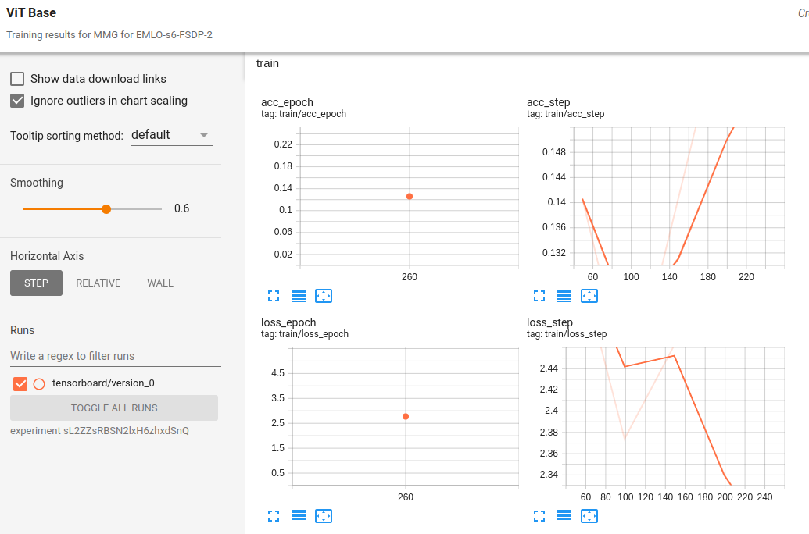

# EMLO Session 6


## DDP-1
- [x] Single-Node, Multi-GPU
- [x] g3.8xlarge instance with 2 GPUs
- [x] Tesla M60 GPUs; 8 GB Memory
- [x] Batch Size: 48
- [x] Precision: 16


To run the script.

```bash
python3 src/train.py experiment=timm trainer=ddp callbacks.model_checkpoint.dirpath=logs/train/runs/$(date +%Y-%m-%d_%H-%M)/checkpoints trainer.default_root_dir=$(date +%Y-%m-%d_%H-%M)
```

To view logs, go to [TensorboardDev](https://tensorboard.dev/experiment/E4emW4fLQEGL1XgoFLBFgQ/)




For GPU utilization, a[ python script](https://www.kaggle.com/code/scottclowe/cpu-and-gpu-usage-logging-demo) was used 



## DDP-2
- [x] Multi-Node, Single-GPU
- [x] g4dn.xlarge (spot) instances with 1 GPU each
- [x] NVIDIA T4 Tensor Core GPUs; 16 GB Memory
- [x] Batch Size: 96
- [x] Precision: 16


To run the script:
On Master Node:

```bash
MASTER_PORT=29500 MASTER_ADDR=18.116.241.22 WORLD_SIZE=2 NODE_RANK=0 python3 src/train.py experiment=timm trainer=ddp trainer.devices=1 trainer.num_nodes=2 callbacks.model_checkpoint.dirpath=logs/train/runs/$(date +%Y-%m-%d_%H-%M)/checkpoints trainer.default_root_dir=$(date +%Y-%m-%d_%H-%M)
```

On Worker Node:
```bash
MASTER_PORT=29500 MASTER_ADDR=18.116.241.22 WORLD_SIZE=2 NODE_RANK=1 python3 src/train.py experiment=timm trainer=ddp trainer.devices=1 trainer.num_nodes=2 callbacks.model_checkpoint.dirpath=logs/train/runs/$(date +%Y-%m-%d_%H-%M)/checkpoints trainer.default_root_dir=$(date +%Y-%m-%d_%H-%M)
```

To view logs, go to [TensorboardDev](https://tensorboard.dev/experiment/66EaDIDARwGrMKezkmWkPg/)



Testing would fail on either the nodes. To fix this, the environment variable `NODE_RANK` was checked. Testing was done if it was 0 (i.e. master node); else it was skipped.

## FSDP-1
- [x] Single-Node, Multi-GPU
- [x] g3.8xlarge instance with 2 GPUs
- [x] Tesla M60 GPUs; 8 GB Memory
- [x] Batch Size: 48
- [x] Precision: 16

`gradient_clip_val` was disabled.

```bash
python3 src/train.py experiment=timm trainer=fsdp callbacks.model_checkpoint.dirpath=logs/train/runs/$(date +%Y-%m-%d_%H-%M)/checkpoints trainer.default_root_dir=$(date +%Y-%m-%d_%H-%M)
```

To view logs, go to [TensorboardDev](https://tensorboard.dev/experiment/XXgZCyL0TbmI56gpC1feZg/)





## FSDP-2
- [x] Multi-Node, Single-GPU
- [x] g4dn.xlarge (spot) instances with 1 GPU each
- [x] NVIDIA T4 Tensor Core GPUs; 16 GB Memory
- [x] Batch Size: 96
- [x] Precision: 16

`gradient_clip_val` was disabled.

Master Node:
```bash
export NODE_RANK=0
MASTER_PORT=29500 MASTER_ADDR=13.58.225.189 WORLD_SIZE=2 NODE_RANK=0 python3 src/train.py experiment=timm trainer=fsdp callbacks.model_checkpoint.dirpath=logs/train/runs/$(date +%Y-%m-%d_%H-%M)/checkpoints trainer.default_root_dir=$(date +%Y-%m-%d_%H-%M)
```

Worker Node:
```bash
export NODE_RANK=1
MASTER_PORT=29500 MASTER_ADDR=13.58.225.189 WORLD_SIZE=2 NODE_RANK=1 python3 src/train.py experiment=timm trainer=fsdp callbacks.model_checkpoint.dirpath=logs/train/runs/$(date +%Y-%m-%d_%H-%M)/checkpoints trainer.default_root_dir=$(date +%Y-%m-%d_%H-%M)
```

To view logs, go to [TensorboardDev](https://tensorboard.dev/experiment/sL2ZZsRBSN2lxH6zhxdSnQ/
)

